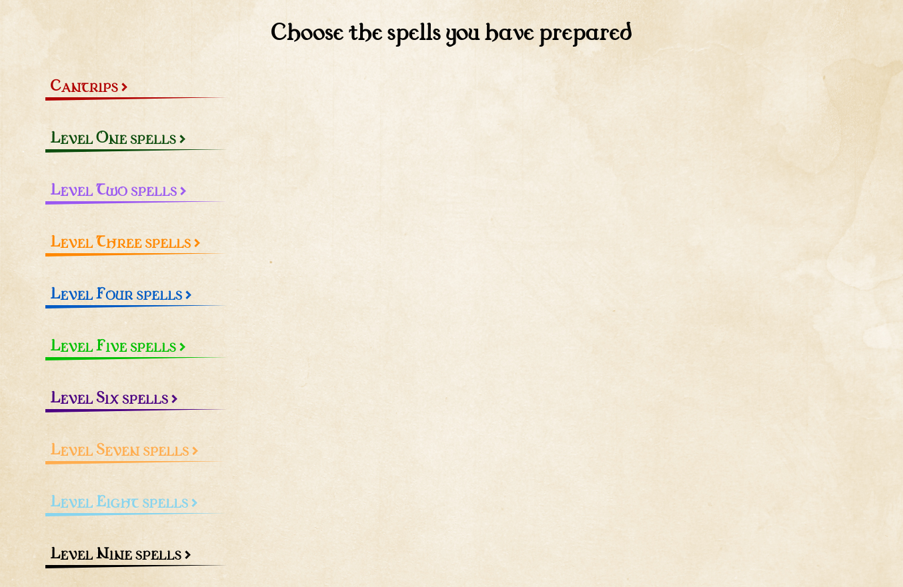
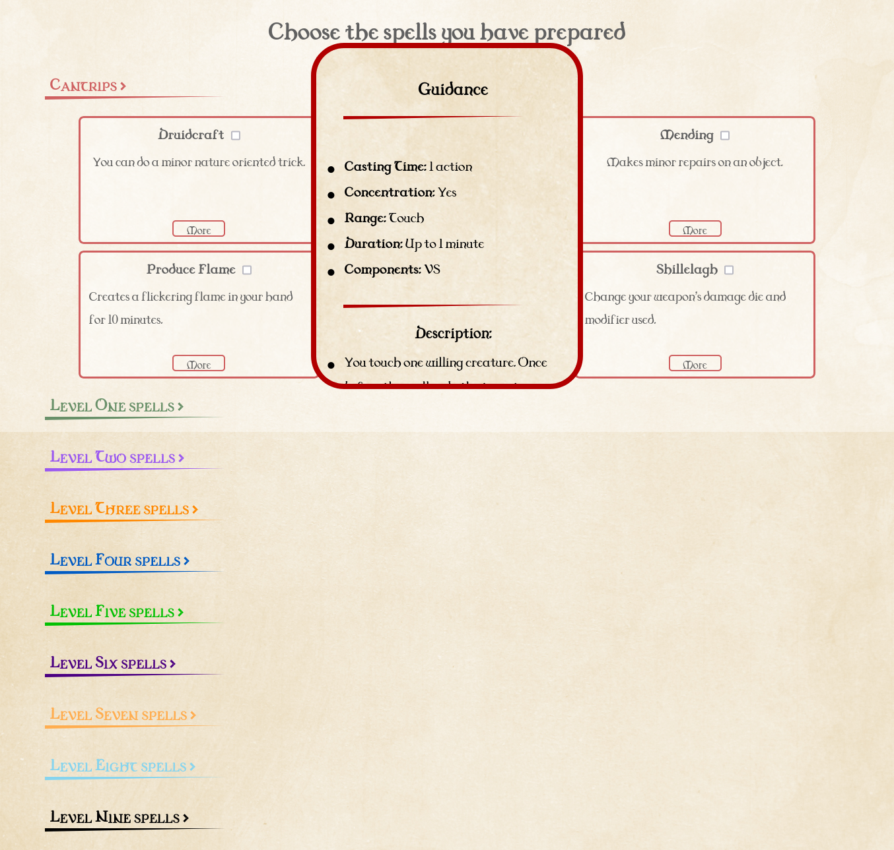

  

# D&D 5e Druid Spell Organizer

> Web application to organize druid's spells for Dungeons and dragons 5th Edition

## Live version 📡

Check out the live version [here](https://druid-spells.netlify.app)

### View the spells per level:

### Click a spell to read more about it:

### View the damage it deals:

## Contributing 🖇️

Any contributions are highly appreciated. There are two things you can do:

1. Create an issue explaining your idea.
2. Fork the project and submit a Pull Request with your idea already developed explaining it in detail.

## License 📄

This project is [MIT](https://choosealicense.com/licenses/mit/) licenced

⌨️ with ❤️ by [Ukliz](https://github.com/Uklizdev) 😊
